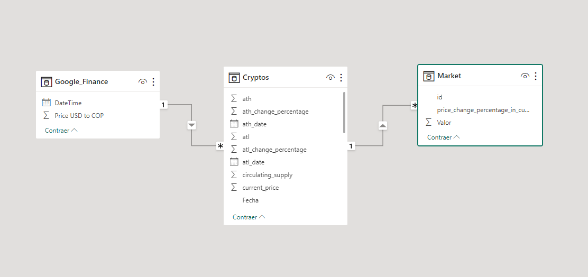

# Análisis de Oportunidades de Inversión en el Top 10 del MarketCap de Criptomonedas

Bienvenido al proyecto de Data Analytics sobre oportunidades de inversión en el Top 10 del MarketCap de criptomonedas. Este análisis tiene como objetivo identificar patrones y tendencias en el mercado de criptomonedas para ayudar en la toma de decisiones de inversión.

## Introducción

El objetivo principal de este proyecto es identificar oportunidades de inversión en el Top 10 del MarketCap de criptomonedas. Para lograr esto, hemos realizado un proceso de Extracción, Transformación y Carga (ETL) de datos provenientes de diversas fuentes y realizado un análisis exploratorio de datos (EDA) para obtener información valiosa.

## Métricas Clave

Hemos creado varias métricas clave que son fundamentales para el análisis y la construcción de un Dashboard informativo:

| Métrica | Fórmula | Descripción |
|---------|---------|-------------|
| circulating_percent | ['circulating_supply'] / ['total_supply'] * 100 | Porcentaje de las criptomonedas en circulación |
| remaining_percent | 100 - ['circulating_percent'] | Porcentaje de criptomonedas que todavía no están en circulación |
| market_cap_percent | ['market_cap'] / []'fully_diluted_valuation'] * 100 | Porcentaje del MarketCap con respecto a la estimación de crecimiento total |
| rest_diluted_percent | 100 - ['market_cap_percent'] | Porcentaje restante de la estimación de crecimiento |
| risk_percentage_predicted | Modelo de regresión lineal | Porcentaje de riesgo de inversión |

## Conjunto de Datos

Hemos recopilado datos de diferentes fuentes para construir nuestro análisis:

1. Cryptos_Top10: Datos de las 10 criptomonedas con mayor MarketCap obtenidos de la API CoinGecko.
2. MarketCryptos_Top10: Datos adicionales de las 10 criptomonedas principales desde la misma API.
3. USD_to_COP: Tasa de cambio del dólar a pesos colombianos obtenida de Google Finance.
4. Volumen24h_Top10: Volumen en las últimas 24 horas de las 10 criptomonedas principales, extraído utilizando un script Python.

## KPIs Relevantes

Hemos definido KPIs importantes para evaluar las oportunidades de inversión:

| KPI | Fórmula | Descripción |
|-----|---------|-------------|
| Volatilidad | Desviación estándar de los precios / Precio promedio | Mide la volatilidad de una criptomoneda en un período de tiempo. |
| Capitalización de mercado | Precio de la criptomoneda x Suministro circulante | Representa el valor total de una criptomoneda en circulación. |
| Potencial de crecimiento | 100 - market_cap_percent | Indica el potencial de crecimiento restante de una criptomoneda en comparación con su estimación total de crecimiento. |

## Modelo de Datos

Hemos creado un Modelo Estrella para relacionar los conjuntos de datos y facilitar el análisis:

## Visualización de Resultados

Hemos generado un Dashboard interactivo utilizando Power BI para presentar los hallazgos y resultados del análisis. Puede acceder al Dashboard [aquí](https://app.powerbi.com/view?r=eyJrIjoiYWRjZGY0YmYtYWZkMC00ZTM0LTk1ZjgtNDljMTNhNWNkZWZmIiwidCI6ImNiYzJjMzgxLTJmMmUtNGQ5My05MWQxLTUwNmM5MzE2YWNlNyIsImMiOjR9).

## Conclusiones

En este proyecto de Data Analytics, hemos identificado oportunidades de inversión en el Top 10 del MarketCap de criptomonedas. Las métricas clave, los KPIs y el análisis exploratorio de datos nos han proporcionado una visión profunda del mercado de criptomonedas y las posibles oportunidades de inversión.

## Referencias

1. CoinGecko API: [https://api.coingecko.com](https://api.coingecko.com)
2. Google Finance: [https://www.google.com/finance](https://www.google.com/finance)
3. Power BI: [https://powerbi.microsoft.com](https://powerbi.microsoft.com)
